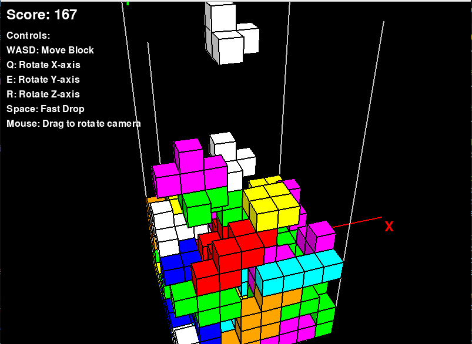

# 3D Tetris Game

## Overview
This project is a 3D Tetris game implemented using Python and Pygame. It leverages Object-Oriented Programming (OOP) principles to organize the code into modular, reusable components. The game allows players to control tetromino blocks in a 3D space, rotate them along different axes, and drop them quickly to score points.

---

## Features
- **3D Gameplay**: Navigate and manipulate tetromino blocks in a 3D grid.
- **Keyboard Controls**: Move, rotate, and drop blocks using keyboard inputs.
- **Mouse Wheel Support**: Navigate the menu using the mouse wheel.
- **Leaderboard**: Save and display the top scores.
- **Modular Design**: Organized using OOP principles for scalability and maintainability.

---

## Object-Oriented Programming (OOP) Principles
The project is structured using OOP principles to ensure modularity, reusability, and maintainability. Below are the key components:

### 1. **`Vector3D` Class**
- Represents a 3D vector for positions and movements.
- Provides methods for vector operations like addition, subtraction, normalization, and rotation.

### 2. **`Camera` Class**
- Handles the 3D camera perspective.
- Projects 3D points onto a 2D screen for rendering.

### 3. **`Block` Class**
- Represents individual blocks that make up tetromino shapes.
- Handles rendering and visibility of block faces based on the camera's position.

### 4. **`Tetromino` Class**
- Represents tetromino shapes in the game.
- Provides methods for movement and rotation along the X, Y, and Z axes.

### 5. **`Game` Class**
- Manages the main game logic, including input handling, collision detection, and scoring.
- Integrates all other components to create the gameplay experience.

### 6. **`Menu` Class**
- Handles the main menu interface.
- Allows navigation using keyboard (`W`, `S`, `Enter`, `1`, `2`, `3`) and mouse wheel.

### 7. **`Leaderboard` Class**
- Manages saving and loading scores from a JSON file.
- Displays the top scores in the leaderboard.

---

## How to Play

### Controls
- **Menu Navigation**:
  - Use `W` and `S` to move up and down the menu options.
  - Use `1`, `2`, or `3` to directly select menu options.
  - Use the mouse wheel to scroll through menu options.
  - Press `Enter` to confirm your selection.

- **Gameplay**:
  - Use `W`, `A`, `S`, `D` to move the tetromino block in the 3D grid.
  - Use `Q`, `E`, `R` to rotate the block along the X, Y, and Z axes.
  - Press `Space` to drop the block quickly and score 1 point for each quick drop.

### Objective
- Arrange tetromino blocks to fill layers in the 3D grid.
- Clear layers to score points and prevent the grid from filling up.
- Aim for the highest score!

### Requirements
- Python 3.8 or higher
- Pygame library

